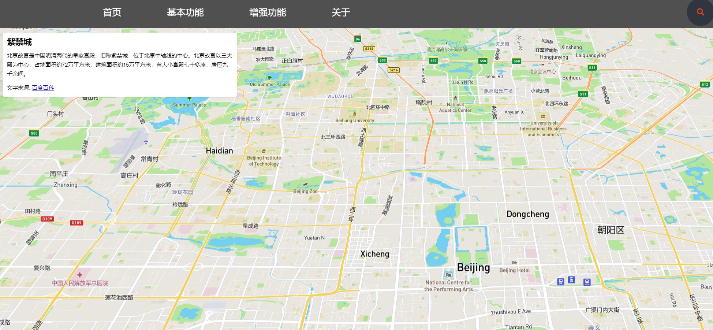
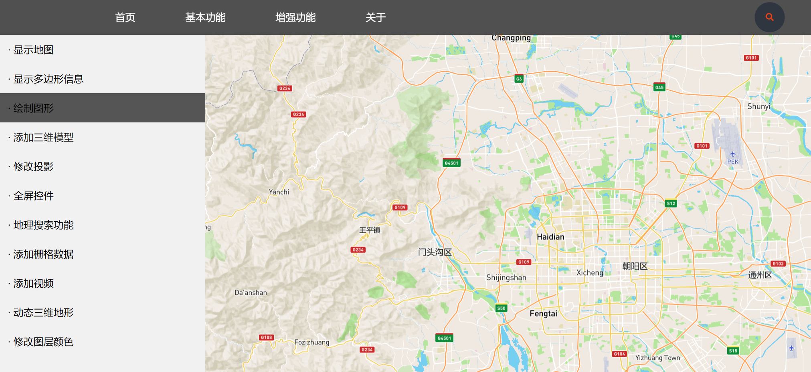

# WebGIS

这是一个基于Mapbox的网页地图操作与展示系统，非常适合作为WebGIS课程的课程设计

This is a web map operation and display system based on Mapbox, which is very suitable for WebGIS curriculum design.

这里是实机演示：[杪春槐夏](https://www.miaochunhuaixia.top)

Here's a demo: [杪春槐夏](https://www.miaochunhuaixia.top)

下载本库之后可以直接打开index.html

主要的功能在[基本功能](https://www.miaochunhuaixia.top/BasicFunction/Menu.html)内实现

Enhancements内是弃用的功能，可以酌情添加
